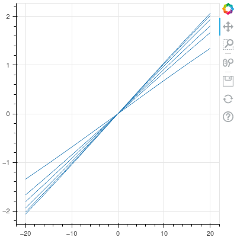
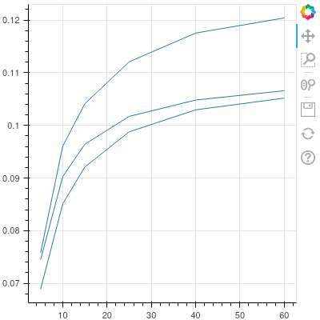
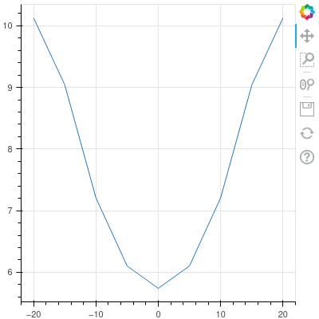
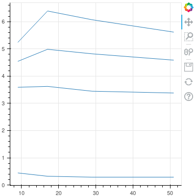
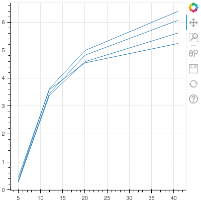
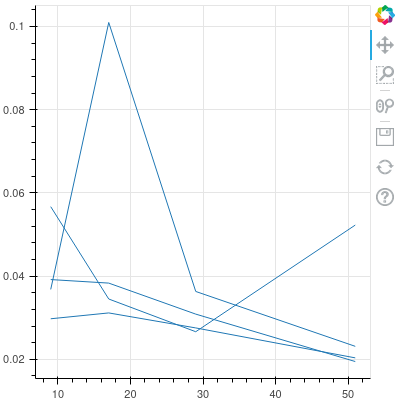
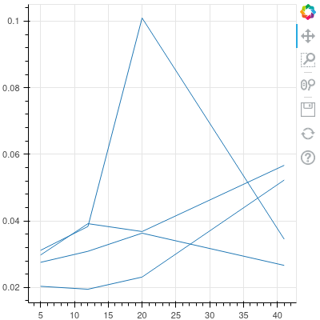

# 
OpenVSP Verification & Validation Studies

#### 
[OpenVSP Home](http://www.openvsp.org) | [OpenVSP Wiki](http://www.openvsp.org/wiki/doku.php)

## 
 Introduction 

This document outlines a series of verification and validation (V&V) studies that have been conducted for the VSPAERO aerodynamic solver.
This HTML wasgenerated from a single *.vspscript file named "Master_VSP_VV_Script.vspscript" located in the scripts directory distributed with the
OpenVSP software. In each of the V&V test cases listed below, there exists published theoretical or experimental results that can be verified for a
particular geometric model. The results from VSPAERO are then able to be validated against the published results to determine the accuracy of the
solver. Each test begins by modeling a wing or series of wing geometries through the OpenVSP API. The geometric parameters are listed in a table for
each study. If a parameter is not listed in the table the default value in OpenVSP should be assumed. Each generated model is saved, and therefore can
be loaded in OpenVSP to verify the model accurately represents the geometry of the V&V study. Depending on the particular test case, the results needed
for validation must then be identified or calculated. Once results for validation are established, VSPAERO is setup and executed through the Analysis
Manager. The VSPAERO analysis inputs are listed in a table for each study, with default values used for items not identified in the tables.
Following VSPAERO execution, results are obtained through the Results Manager, compared to the published results, and displayed.

## 
 Notation 

Need to sort out equation section

## 
 Equations

Lifting Line Theory (LLT) provides the following equations outlined in the NACA TN 3911 *A Method for Predicting Lift Increments Due to Flap Deflection
at Low Angles of Attack in Incompressible Flow* by Lowry and Polhamus:

$$C_{L\alpha} = \frac{2\pi AR }{2 + \sqrt{(\frac{AR^2 B^2}{K^2})(1 + \frac{tan^2 \Lambda_{c/2}}{B^2}) + 4}}$$
$$B = \sqrt{1-M^2}$$
$$K = C_{L\alpha2D}(\frac{180}{\pi})/(2\pi)$$

## 
 Case 1: Hershey Bar

Various Hershey Bar wings with AR ranging from 10 to 60 are modeled through the OpenVSP API for this V&V case.
The Hershey Bar wing has been studied and used for aerodynamic verification and validation studies extensively.
The Hershey Bar wing has a unit length chord and no sweep. For the studies presented below, a symmetric NACA0012 airfoil is
modeled for each Heshey Bar wing. A series of studies are conducted that investigate qualities such as tesselation, aspect ratio,
and advanced settings, and their effect on VSPAERO accuracy. 
### Aspect Ratio Study
In the first Hershey Bar study, the resulting coefficient of lift (\(C_L\)) from VSPAERO's vortex lattice solver is compared to the
approximate \(C_L\) determined for each angle of attack from Lifting Line Theory. The first plot listed below displays these results.

Next, the lift curve slope (\(C_{L\alpha}\)) is calculated for each vortex lattice and panel method VSPAERO result, defined by a particular AR,
by subtracting \(C_L\) at two angle of attack flow condition cases and dividing by the total change in \(\alpha\).
This method, known as central differencing, cannot be used at the minimum or maximum angle of attack values.
For those cases, \(C_{L\alpha}\) is identified as the slope of the \(C_L\) vs \(\alpha\) curve immediately before or after the angle of attack endpoint.
These methods are known as forward and backward differencing. The calculated \(C_{L\alpha}\) values are compared to \(C_{L\alpha}\)
determined by Lifting Line Theory at the associated aspect ratios. A 2D lift curve slope of 0.1096622 per degree is assumed, given a theoretical K ratio
of 1.0. This plot can be seen in the second graph below.
#### 
 Aspect Ratio Study Geometry Setup 

| Airfoil | AR  | Root Chord | Tip Chord | \(\Lambda\) (°) | Span Tess (U) | Chord Tess (W) | LE Clustering | TE Clustering | Tip Clustering |
| :-----: | :-: | :--------: | :-------: | :-------------: | :-----------: | :------------: | :-----------: | :-----------: | :------------: |
| NACA0012 | 5 to 60 | 1.0 | 1.0 | 0.0 | 41 | 51 | 0.2 | 1.0 | 1.0|

#### 
 Aspect Ratio Study VSPAERO Setup 

| Case # | Analysis  | Method | \(\alpha\) (°) | \(\beta\) (°) | M | Wake Iterations |
| :----: | :-------: | :----: | :------------: | :-----------: | :-: | :-----------: |
| 1 | Sweep | VLM | -20.0 to 20.0, npts: 8 | 0.0 | 0.1 | 3 |
| 2 | Single Point | Panel | 1.0 | 0.0 | 0.1 | 3 |

### Angle of Attack Study
Using the same OpenVSP Hershey Bar wing geomentry as the previous study, aspect ratio is held constant and a VSPAERO alpha sweep analysis is conducted.
The goal of this study is to demonstrate how the error in \(C_{L\alpha}\) changes at various angles of attack.
#### 
 Angle of Attack Study Geometry Setup 

| Airfoil | AR  | Root Chord | Tip Chord | \(\Lambda\) (°) | Span Tess (U) | Chord Tess (W) | LE Clustering | TE Clustering | Tip Clustering |
| :-----: | :-: | :--------: | :-------: | :-------------: | :-----------: | :------------: | :-----------: | :-----------: | :------------: |
| NACA0012 | 10 | 1.0 | 1.0 | 0.0 | 12 | 17 | 0.2 | 1.0 | 1.0|

#### 
 Aspect Ratio Study VSPAERO Setup 

| Case # | Analysis  | Method | \(\alpha\) (°) | \(\beta\) (°) | M | Wake Iterations |
| :----: | :-------: | :----: | :------------: | :-----------: | :-: | :-----------: |
| 1 | Sweep | VLM | -20.0 to 20.0, npts: 9 | 0.0 | 0.1 | 3 |

### Tesselation Study
The next Hershey Bar study investigates the effects of tesselation on VSPAERO VLM results by varying U and W tesselation for a particular AR case.
Two charts are generated and can be seen below. The chart on the left displays the percent error between VSPAERO and theoretical lifting line
\(C_{L\alpha}\) results as chord tesselation increases at various span tesselations. The charts on the right display the same error,
but as span tesselation increases at various chord tesselations.
#### 
 Tesselation Study Geometry Setup 

| Airfoil | AR  | Root Chord | Tip Chord | \(\Lambda\) (°) | Span Tess (U) | Chord Tess (W) | LE Clustering | TE Clustering | Tip Clustering |
| :-----: | :-: | :--------: | :-------: | :-------------: | :-----------: | :------------: | :-----------: | :-----------: | :------------: |
| NACA0012 | 10 | 1.0 | 1.0 | 0.0 | 5 to 41 | 9 to 51 | 0.2 | 1.0 | 1.0|

#### 
 Tesselation Study VSPAERO Setup 

| Analysis  | Method | \(\alpha\) (°) | \(\beta\) (°) | M | Wake Iterations |
| :-------: | :----: | :------------: | :-----------: | :-: | :-----------: |
| Single Point | VLM | 1.0 | 0.0 | 0.1 | 3 |

Next, the VSPAERO execution time is considered at various chord and span tesselation values.
In conjunction with the plots above, the plots below allow for a comparison between percent error and VSPAERO execution time
as tesselation is varied in both the chordwise and spanwise directions.

### Tip Clustering Study
This next study looks at the influence of tip clustering on \(C_L\) distribution along the Hershey Bar wing span.
Tip clustering is varied while aspect ratio, chord tesselation, and span tesselation are held constant.
The \(C_L\) distribution across the span is compared to the lifting line approximate \(C_L\) distribution found using Glauert's method.
In addition, lift distribution results are generated in Athena Vortex Lattice v3.37 (AVL) for the Hershey Bar wing using the same setup conditions as
VSPAERO. The AVL input file, "Hershey_AR10.avl", and results file, "Hershey_AR10_AVL.dat", can be found in the same directory as the Master V&V Script.
The plots below display how tip clustering effects the error between VSPAERO VLM and LLT.

#### 
 Tip Clustering Study Geometry Setup 

| Airfoil | AR  | Root Chord | Tip Chord | \(\Lambda\) (°) | Span Tess (U) | Chord Tess (W) | LE Clustering | TE Clustering | Tip Clustering |
| :-----: | :-: | :--------: | :-------: | :-------------: | :-----------: | :------------: | :-----------: | :-----------: | :------------: |
| NACA0012 | 10 | 1.0 | 1.0 | 0.0 | 12 | 17 | 0.2 | 1.0 | 1.0, 0.5, 1.0|

#### 
 Tip Clustering Study VSPAERO Setup 

| Analysis  | Method | \(\alpha\) (°) | \(\beta\) (°) | M | Wake Iterations |
| :-------: | :----: | :------------: | :-----------: | :-: | :-----------: |
| Single Point | VLM | 1.0 | 0.0 | 0.1 | 3 |

#### 
 Tip Clustering Study AVL Setup 

| Nchord  | Cspace | Nspan | Sspan | M |
| :-----: | :----: | :---: | :---: | :-: |
| 30 | 1.0 | 20 | -3.0 | 0.1 |

### Span Tesselation Study
The impact of span tesselation on \(C_L\) distribution along the Hershey Bar wing span is investigated first in this study.
While holding aspect ratio, chord tesselation, and tip clustering constant, span tesselation is varied.
The first plot below displays the \(C_L\) distribution across the span compared to the lifting line approximate \(C_L\) distribution found using Glauert's method.
In addition, the lift distribution results computed by AVL for an identical geometry and flow condition input are plotted.

#### 
 Span Tesselation Study Geometry Setup 

| Airfoil | AR  | Root Chord | Tip Chord | \(\Lambda\) (°) | Span Tess (U) | Chord Tess (W) | LE Clustering | TE Clustering | Tip Clustering |
| :-----: | :-: | :--------: | :-------: | :-------------: | :-----------: | :------------: | :-----------: | :-----------: | :------------: |
| NACA0012 | 10 | 1.0 | 1.0 | 0.0 | 5 to 41 | 17 | 0.2 | 1.0 | 1.0 |

#### 
 Span Tesselation Study VSPAERO Setup 

| Analysis  | Method | \(\alpha\) (°) | \(\beta\) (°) | M | Wake Iterations |
| :-------: | :----: | :------------: | :-----------: | :-: | :-----------: |
| Single Point | VLM | 1.0 | 0.0 | 0.1 | 3 |

#### 
 Span Tesselation Study AVL Setup 

| Nchord  | Cspace | Nspan | Sspan | M |
| :-----: | :----: | :---: | :---: | :-: |
| 30 | 1.0 | 20 | -3.0 | 0.1 |

The impact of span tesselation on \(C_{Di}\) distribution along the Hershey Bar wing span is looked at next. As in the plot above, aspect ratio,
chord tesselation, and tip clustering are held constant as span tesselation is varied. The plot below displays the \(C_{Di}\) distribution across the span
compared to the lifting line approximate \(C_{Di}\) distribution, and the drag distribution determined by AVL. The AVL input and results file are located in
the same directory as the Master V&V Script ("Hershey_AR10.avl" and "Hershey_AR10_AVL.dat" respectively).

### Chord Tesselation Study
This next lift distribution study is similar to the previous one, except here the influence of chord tesselation is presented.
Span tesselation, aspect ratio, and tip clustering are all held constant. The plots below compare the VSPAERO \(C_L\) distribution for the Hershey Bar
wing to the lifting line theory approximate solution. The same geometry and flow condition inputs were run in AVL to generate lift distribution results.
The AVL results are read in and plotted as well. The results file, "Hershey_AR10_AVL.dat", may be viewed in the scripts directory.

#### 
 Chord Tesselation Study Geometry Setup 

| Airfoil | AR  | Root Chord | Tip Chord | \(\Lambda\) (°) | Span Tess (U) | Chord Tess (W) | LE Clustering | TE Clustering | Tip Clustering |
| :-----: | :-: | :--------: | :-------: | :-------------: | :-----------: | :------------: | :-----------: | :-----------: | :------------: |
| NACA0012 | 10 | 1.0 | 1.0 | 0.0 | 12 | 9 to 51 | 0.2 | 1.0 | 1.0 |

#### 
 Chord Tesselation Study VSPAERO Setup 

| Analysis  | Method | \(\alpha\) (°) | \(\beta\) (°) | M | Wake Iterations |
| :-------: | :----: | :------------: | :-----------: | :-: | :-----------: |
| Single Point | VLM | 1.0 | 0.0 | 0.1 | 3 |

#### 
 Chord Tesselation Study AVL Setup 

| Nchord  | Cspace | Nspan | Sspan | M |
| :-----: | :----: | :---: | :---: | :-: |
| 30 | 1.0 | 20 | -3.0 | 0.1 |

Chord tesselation's influence on induced drag coefficient distribution for the Hershey Bar wing is then looked at.
Aspect ratio, span tesselation, and tip clustering are all held constant while chord tesselation is varied.
The lifting line approximate \(C_{Di}\) distribution calculated using Glauert's method is plotted below alongside the results generated from VSPAERO.
In addition, AVL's drag distribution for the Hershey Bar wing is displayed.

### Wake Iteration Study 
This next lift distribution study demonstrates the effect of the number of wake iterations on VSPAERO lift coefficient distribution.
Span tesselation, chord tesselation, aspect ratio, and tip clustering are all held constant. In the first plot below, the lift distribution is plotted for each wake iteration case. 
Below the lift distribution plot, the VSPAERO total computation time is plotted for each wake iteration case.
Combined, these plots demonstrate the increase in VSPAERO accuracy as the number of wake iterations is increased, but at a cost to overall computation time.

#### 
 Wake Iteration Study Geometry Setup 

| Airfoil | AR  | Root Chord | Tip Chord | \(\Lambda\) (°) | Span Tess (U) | Chord Tess (W) | LE Clustering | TE Clustering | Tip Clustering |
| :-----: | :-: | :--------: | :-------: | :-------------: | :-----------: | :------------: | :-----------: | :-----------: | :------------: |
| NACA0012 | 10 | 1.0 | 1.0 | 0.0 | 12 | 17 | 0.2 | 1.0 | 1.0 |

#### 
 Wake Iteration Study VSPAERO Setup 

| Analysis  | Method | \(\alpha\) (°) | \(\beta\) (°) | M | Wake Iterations |
| :-------: | :----: | :------------: | :-----------: | :-: | :-----------: |
| Single Point | VLM | 1.0 | 0.0 | 0.1 | 1 to 5 |

### Advanced Settings Study

In this study, the various advanced VSPAERO settings are investigated and compared for the Hershey Bar wing.
The settings of interest are the preconditioner and 2nd order Karman-Tsien Mach Correction. The three types of preconditioners
available are matrix, Jacobi, and symmetric successive over-relaxation (SSOR). For each VSPAERO run case, only a single advanced setting
is varied at a time while all others are left at their default value. The last column of the VSPAERO setup table displays the VSPAERO
computation time for each case. The lift distribution is plotted for each case and compared to the theoretical lift distribution determined by Glauert's method.
This process is repeated for one, two, and three wake iterations.

#### 
 Advanced Settings Study Geometry Setup 

| Airfoil | AR  | Root Chord | Tip Chord | \(\Lambda\) (°) | Span Tess (U) | Chord Tess (W) | LE Clustering | TE Clustering | Tip Clustering |
| :-----: | :-: | :--------: | :-------: | :-------------: | :-----------: | :------------: | :-----------: | :-----------: | :------------: |
| NACA0012 | 15 | 1.0 | 1.0 | 0.0 | 12 | 17 | 0.2 | 1.0 | 1.0 |

#### 
 Advanced Settings Study VSPAERO Setup: Wake Iterations = 1 

| Case # | Analysis  | Method | \(\alpha\) (°) | \(\beta\) (°) | M | Wake Iterations |
| :----: | :-------: | :----: | :------------: | :-----------: | :-: | :-----------: |
| 1 | Sweep | VLM | -20.0 to 20.0, npts: 8 | 0.0 | 0.1 | 3 |
| 2 | Single Point | Panel | 1.0 | 0.0 | 0.1 | 3 |

## 
 References 

1. Abbott, I. & Doenhoff, A. (1959). Theory of Wing Sections: Including a Summary of Airfoil Data. NY: Dover Publications, Inc.
2. Ashley, H. & Landahl, M. (1965). Aerodynamics of Wings and Bodies. MA: Addison-Wesley Publishing Company, Inc.
3. Bertin, J. J., & Smith, M. L. (1994). Aerodynamics for Engineers(2nd ed.). Englewood Cliffs, NJ: Prentice Hall.
4. Drela, M. & Youngren, H. (2017). AVL 3.36 User Primer.http://web.mit.edu/drela/Public/web/avl/avl_doc.txt.
5. Drela, M. & Youngren, H. (2001). XFOIL 6.9 User Primer.http://web.mit.edu/drela/Public/web/xfoil/xfoil_doc.txt.
6. Hoerner, S. F., & Borst, H. V. (1985). Fluid-Dynamic Lift: Practical Information on Aerodynamic and Hydrodynamic Lift (2nd ed.). Albuquerque/N.M.: Hoerner.
7. Katz, J. & Plotkin, A. (2001). Low-Speed Aerodynamics (2nd ed.). New York: Cambridge University Press.
8. Kinney, D. (2016, August 24). VSPAERO Verification & Next Steps. Live presentation at NASA Ames Conference Center, Mountain View.
9. Lamb, H. (1932). Hydrodynamics (6th ed.). Cambridge, MA: Cambridge University Press.
10. Lowry, J. & Polhamus, E. (1957). A Method for Predicting Lift Increments Due to Flap Deflection at Low Angles of Attack in Incompressible Flow. Virginia: National Advisory Committee for Aeronautics. https://ntrs.nasa.gov/archive/nasa/casi.ntrs.nasa.gov/19930084818.pdf. doi:19930084818
11. Munk, M. (1924). Remarks on the Pressure Distribution over the Surface of an Ellipsoid, Moving Translationally Through a Perfect Fluid. Washington, DC: National Advisory Committee for Aeronautics. https://ntrs.nasa.gov/archive/nasa/casi.ntrs.nasa.gov/19930080983.pdf. doi:19930080983
12. Oliviu, S. G., Andreea K., & Ruxandra M. B. (2016). A New Non-Linear Vortex Lattice Method: Applications to Wing Aerodynamic Optimizations. Quebec: LARCASE Laboratory of Applied Research in Active Controls, Avionics, and Aeroelasticity. https://ac.els-cdn.com/S1000936116300954/1-s2.0-S1000936116300954-main.pdf?_tid=ecb8e5ea-d93a-11e7-afba-00000aacb362&acdnat=1512423465_5a88062ebd97b0cac725b33f68055f9d.